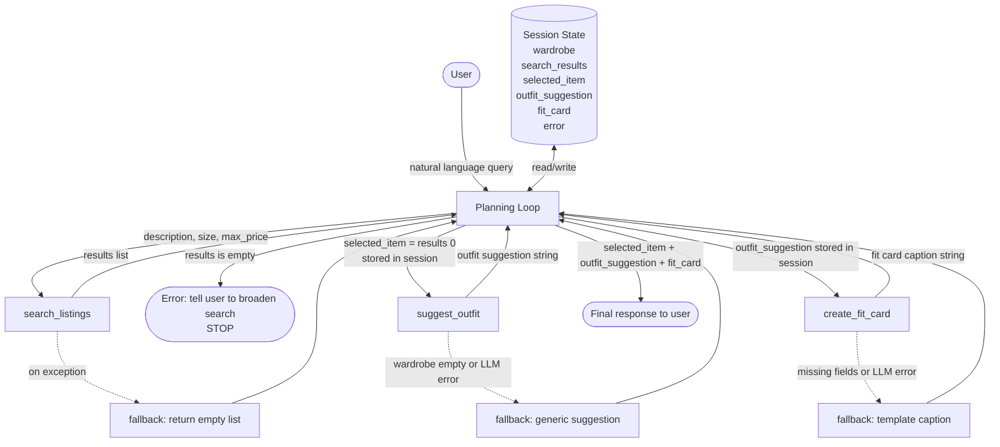

# FitFindr — planning.md

> Complete this document before writing any implementation code.
> Your spec and agent diagram are what you'll use to direct AI tools (Claude, Copilot, etc.) to generate your implementation — the more specific they are, the more useful the generated code will be.
> Your planning.md will be reviewed as part of your submission.
> Update it before starting any stretch features.

---

## Tools

List every tool your agent will use. For each tool, fill in all four fields.
You must have at least 3 tools. The three required tools are listed — add any additional tools below them.

### Tool 1: search_listings

**What it does:**
Loads the mock listings dataset using `load_listings()` and filters it against the user's query. It scores each listing for relevance based on keyword overlap in `title`, `description`, and `style_tags`, then filters out items that don't match `size` or exceed `max_price`, returning the top matches sorted by relevance score descending.

**Input parameters:**
- `description` (str): A natural-language phrase describing the item the user wants (e.g., "vintage graphic tee"). Used to match against `title`, `description`, and `style_tags` fields in the listings data.
- `size` (str): The user's size (e.g., "M", "S/M", "W30 L30"). Matched against the `size` field in each listing.
- `max_price` (float): The maximum price the user is willing to pay. Listings with `price` above this value are excluded.

**What it returns:**
A list of listing dicts, each containing: `id` (str), `title` (str), `description` (str), `category` (str), `style_tags` (list of str), `size` (str), `condition` (str — one of: excellent, good, fair), `price` (float), `colors` (list of str), `brand` (str or null), `platform` (str — e.g., "depop", "thredUp"). The list is sorted by relevance score (highest first). Returns an empty list `[]` if nothing matches.

**What happens if it fails or returns nothing:**
If the returned list is empty, the agent sets an error message in session state explaining that no listings matched and suggests the user broaden their search (e.g., try a higher price, a different size string, or a simpler description). The agent returns this message to the user and stops — it does not call `suggest_outfit` or `create_fit_card`.

---

### Tool 2: suggest_outfit

**What it does:**
Takes the selected listing item and the user's current wardrobe, then uses the LLM to generate one or more complete outfit combinations. It builds a prompt describing the new item's style tags and colors alongside each wardrobe item's name, category, colors, and style tags, asking the model to suggest pairings with brief styling notes.

**Input parameters:**
- `new_item` (dict): A single listing dict as returned by `search_listings` — contains `title`, `description`, `category`, `style_tags`, `colors`, `condition`, `price`, and `platform`.
- `wardrobe` (dict): A wardrobe object matching the schema in `data/wardrobe_schema.json`. Has a single key `"items"` whose value is a list of wardrobe item dicts, each with `id`, `name`, `category`, `colors`, `style_tags`, and optional `notes`. May be an empty list.

**What it returns:**
A string containing one or more outfit suggestions. Each suggestion names specific wardrobe pieces by their `name` field and includes a short styling note (e.g., how to tuck, layer, or accessorize). If multiple outfits are suggested, they are separated by newlines.

**What happens if it fails or returns nothing:**
If `wardrobe["items"]` is empty, the agent does not call the LLM with an empty context — instead it generates a generic styling suggestion based solely on the new item's `style_tags` and `category`, noting that no personal wardrobe was provided. If the LLM call itself errors, the agent catches the exception, logs it, and returns a fallback message: "Couldn't generate outfit suggestions right now — but this [item title] would pair well with classic basics like jeans and white sneakers."

---

### Tool 3: create_fit_card

**What it does:**
Uses the LLM to generate a short, casual, first-person social-media caption describing the complete outfit. The prompt instructs the model to write in a lowercase, conversational style as if captioning an Instagram post — referencing the specific item, its price, platform, and the outfit pieces.

**Input parameters:**
- `outfit` (str): The outfit suggestion string returned by `suggest_outfit` — describes which wardrobe pieces to pair and how to style them.
- `new_item` (dict): The selected listing dict from `search_listings` — used to pull `title`, `price`, `platform`, and `condition` for the caption.

**What it returns:**
A single string: a 1–3 sentence casual caption in lowercase, referencing the thrifted item (including price and platform), one or two outfit pieces from the suggestion, and optionally a brief vibe or emoji. Each call should produce a distinct result for different inputs.

**What happens if it fails or returns nothing:**
If `outfit` is an empty string or `new_item` is missing required fields (`title`, `price`, `platform`), the agent skips the LLM call and returns a minimal fallback caption constructed directly from whatever fields are available (e.g., "just copped [title] for $[price] off [platform] — styling inspo coming soon"). If the LLM call errors, the agent catches the exception and returns the same fallback template.

---

### Additional Tools (if any)

<!-- Copy the block above for any tools beyond the required three -->

---

## Planning Loop

**How does your agent decide which tool to call next?**

The agent runs a sequential planning loop with explicit checks after each tool call:

1. **Parse user input.** Extract `description`, `size`, and `max_price` from the user's natural-language message. If any required field is missing, prompt the user before proceeding.

2. **Call `search_listings(description, size, max_price)`.**
   - If `results` is an empty list → store an error message in session state, return it to the user ("No listings matched — try a higher price or simpler description"), and **stop**.
   - If `results` is non-empty → store `results` in session state, set `selected_item = results[0]` (top result by relevance), and proceed to step 3.

3. **Call `suggest_outfit(new_item=selected_item, wardrobe=session["wardrobe"])`.**
   - If `wardrobe["items"]` is empty → call `suggest_outfit` anyway; the tool handles this by generating a generic suggestion from the item alone.
   - If the tool returns a non-empty string → store `outfit_suggestion` in session state and proceed to step 4.
   - If the tool returns an empty string or raises an exception → store fallback suggestion in session state and proceed to step 4 with the fallback (do not stop).

4. **Call `create_fit_card(outfit=outfit_suggestion, new_item=selected_item)`.**
   - If the tool returns a non-empty string → store `fit_card` in session state and proceed to final output.
   - If the tool fails → use the fallback caption template (see Tool 3 failure mode) and proceed to final output.

5. **Assemble final response.** Present the user with: the selected listing (title, price, platform, condition), the outfit suggestion, and the fit card caption. The loop is done.

---

## State Management

**How does information from one tool get passed to the next?**

A `session` dictionary is initialized at the start of each interaction and passed through the planning loop. It holds:

- `session["wardrobe"]`: populated at startup from `get_example_wardrobe()` (or `get_empty_wardrobe()` if no wardrobe is provided). Available before any tool is called.
- `session["search_results"]`: list of listing dicts set after `search_listings` returns successfully.
- `session["selected_item"]`: the top listing dict (`search_results[0]`), set immediately after a non-empty search result.
- `session["outfit_suggestion"]`: the suggestion string returned by `suggest_outfit`, or the fallback string if that tool failed.
- `session["fit_card"]`: the caption string returned by `create_fit_card`, or the fallback caption.
- `session["error"]`: set to a user-facing error string if a tool fails fatally (currently only `search_listings` returning empty). Checked by the planning loop to decide whether to stop.

Each tool receives its inputs directly from the planning loop, which reads from `session` — no tool reads `session` directly.

---

## Error Handling

For each tool, describe the specific failure mode you're handling and what the agent does in response.

| Tool | Failure mode | Agent response |
|------|-------------|----------------|
| search_listings | No results match the query | Store error in `session["error"]`; return message to user: "No listings matched — try a higher max price, a different size (e.g., 'S/M' instead of 'S'), or a simpler description." Stop the loop — do not call suggest_outfit or create_fit_card. |
| suggest_outfit | Wardrobe is empty (`wardrobe["items"] == []`) | Call the LLM with only the new item's data and a note that no wardrobe was provided. Return a generic suggestion like "Pair with straight-leg jeans and white sneakers for a clean streetwear look." Store result in `session["outfit_suggestion"]` and continue. |
| create_fit_card | Outfit input is empty string or new_item missing `title`/`price`/`platform` | Skip the LLM call. Construct a fallback caption from available fields: "just copped [title] for $[price] off [platform] — styling inspo coming soon." Store in `session["fit_card"]` and continue to final output. |

---

## Architecture



---

## AI Tool Plan

<!-- For each part of the implementation below, describe:
     - Which AI tool you plan to use (Claude, Copilot, ChatGPT, etc.)
     - What you'll give it as input (which sections of this planning.md, your agent diagram)
     - What you expect it to produce
     - How you'll verify the output matches your spec before moving on

     "I'll use AI to help me code" is not a plan.
     "I'll give Claude my Tool 1 spec (inputs, return value, failure mode) and ask it to implement
     search_listings() using load_listings() from the data loader — then test it against 3 queries
     before trusting it" is a plan. -->

**Milestone 3 — Individual tool implementations:**

For **`search_listings`**, I'll give Claude the Tool 1 block from this planning.md (inputs, return value, failure mode) plus the listing field names from `data/listings.json`, and ask it to implement the function using `load_listings()` from `utils/data_loader.py`. I'll specify that it must filter by `size` (exact or substring match), `price <= max_price`, and score relevance by counting keyword matches across `title`, `description`, and `style_tags`. Before using the output, I'll verify: (1) the function imports `load_listings`, (2) all three filter parameters are applied, (3) the empty-results case returns `[]` not `None`, and (4) results are sorted descending by score. Then I'll test with three queries: one that returns results, one with a price so low nothing matches, and one with an uncommon size.

For **`suggest_outfit`**, I'll give Claude the Tool 2 block from this planning.md plus the wardrobe schema from `data/wardrobe_schema.json`. I'll ask it to build a prompt that lists the new item's `title`, `style_tags`, and `colors`, then enumerates each wardrobe item's `name`, `category`, `colors`, `style_tags`, and `notes`, and instructs the LLM to suggest one or two pairings with styling notes. I'll verify: (1) the empty-wardrobe branch is handled separately without calling the LLM with an empty list, (2) the LLM call is wrapped in try/except, (3) the fallback string is returned on error. I'll test with the example wardrobe, with an empty wardrobe, and with a mocked LLM exception.

For **`create_fit_card`**, I'll give Claude the Tool 3 block from this planning.md. I'll ask it to build a prompt instructing the LLM to write a 1–3 sentence lowercase Instagram-style caption referencing the item's `title`, `price`, `platform`, and at least one piece from the `outfit` string. I'll verify: (1) both `outfit` and `new_item` are validated before the LLM call, (2) the fallback template is used when fields are missing, (3) the LLM call is wrapped in try/except. I'll test with a full outfit + item, with an empty outfit string, and with a new_item dict missing `platform`.

**Milestone 4 — Planning loop and state management:**

I'll give Claude the Planning Loop section, State Management section, and the Architecture Mermaid diagram from this planning.md. I'll ask it to implement the `run_agent(user_message, wardrobe)` function that initializes `session`, parses the user message for the three search parameters, and executes the conditional loop exactly as specified (stop on empty search results, continue with fallback on suggest_outfit or create_fit_card failures). I'll verify: (1) `session` is initialized with `wardrobe` before any tool call, (2) the loop stops and returns an error message when `search_results` is empty, (3) `selected_item` is always `results[0]` not the full list, (4) each session key is set before the next tool reads it. I'll trace through the example query from the Complete Interaction section manually against the code to confirm the flow matches.

---

## A Complete Interaction (Step by Step)

FitFindr receives a natural-language request and runs three tools in sequence: `search_listings` is triggered first to find matching secondhand items given the user's description, size, and budget; if it returns results, `suggest_outfit` is triggered with the top listing and the user's wardrobe to generate styling combinations; and finally `create_fit_card` is triggered with the outfit suggestion to produce a shareable caption. If `search_listings` returns nothing, the agent immediately surfaces an actionable error message and stops — it never calls the downstream tools with empty input.

Write out what a full user interaction looks like from start to finish — tool call by tool call. Use a specific example query.

**Example user query:** "I'm looking for a vintage graphic tee under $30, size M. I mostly wear baggy jeans and chunky sneakers. What's out there and how would I style it?"

**Step 1:**
The planning loop parses the message and extracts: `description = "vintage graphic tee"`, `size = "M"`, `max_price = 30.0`. It calls `search_listings("vintage graphic tee", size="M", max_price=30.0)`.

`load_listings()` returns all listings. The tool filters to items where `price <= 30.0` and `size` contains "M". It scores each remaining item by counting how many of the words ["vintage", "graphic", "tee"] appear in `title`, `description`, and `style_tags`. It sorts by score and returns the top matches. Example return:
```
[
  {"id": "lst_002", "title": "Y2K Baby Tee — Butterfly Print", "price": 18.0, "size": "S/M", "platform": "depop", "condition": "excellent", "style_tags": ["y2k", "vintage", "graphic tee", ...], ...},
  {"id": "lst_005", "title": "Faded Band Tee — Black", "price": 22.0, "size": "M", "platform": "depop", "condition": "good", ...}
]
```
Results are non-empty. The planning loop sets `session["search_results"] = results` and `session["selected_item"] = results[0]` (the Y2K Baby Tee).

**Step 2:**
The planning loop calls `suggest_outfit(new_item=session["selected_item"], wardrobe=session["wardrobe"])`.

`session["wardrobe"]` is the example wardrobe (10 items including baggy straight-leg jeans w_001, chunky white sneakers w_007, black combat boots w_008, etc.). The tool builds a prompt describing the Y2K Baby Tee (white/pink/purple, style_tags: y2k, vintage, graphic tee, cottagecore) alongside all wardrobe items and asks the LLM to suggest pairings.

The LLM returns: `"Pair this Y2K butterfly tee with your baggy straight-leg dark-wash jeans (w_001) and chunky white sneakers (w_007) for a 90s-inspired street look — tuck the front corner to show the print. For a moodier take, swap the sneakers for your black combat boots and throw on the vintage black denim jacket."`

The planning loop sets `session["outfit_suggestion"]` to this string.

**Step 3:**
The planning loop calls `create_fit_card(outfit=session["outfit_suggestion"], new_item=session["selected_item"])`.

The tool validates that `outfit` is non-empty and `new_item` has `title`, `price`, and `platform`. It builds a prompt asking the LLM for a 1–3 sentence lowercase Instagram caption referencing the tee ($18, depop) and the outfit pieces.

The LLM returns: `"found this y2k butterfly tee on depop for $18 and i cannot stop wearing it 🦋 baggy jeans + chunky sneakers and it's giving everything. thrift era never ending"`

The planning loop sets `session["fit_card"]` to this string.

**Final output to user:**
```
Found it: Y2K Baby Tee — Butterfly Print
$18 · depop · excellent condition · size S/M

How to wear it:
Pair this Y2K butterfly tee with your baggy straight-leg dark-wash jeans and chunky white sneakers for a 90s-inspired street look — tuck the front corner to show the print. For a moodier take, swap the sneakers for your black combat boots and throw on the vintage black denim jacket.

Fit card:
found this y2k butterfly tee on depop for $18 and i cannot stop wearing it 🦋 baggy jeans + chunky sneakers and it's giving everything. thrift era never ending
```
